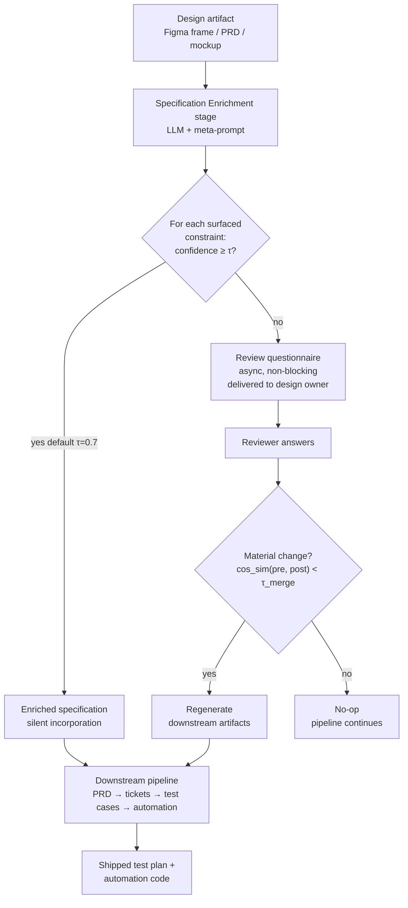
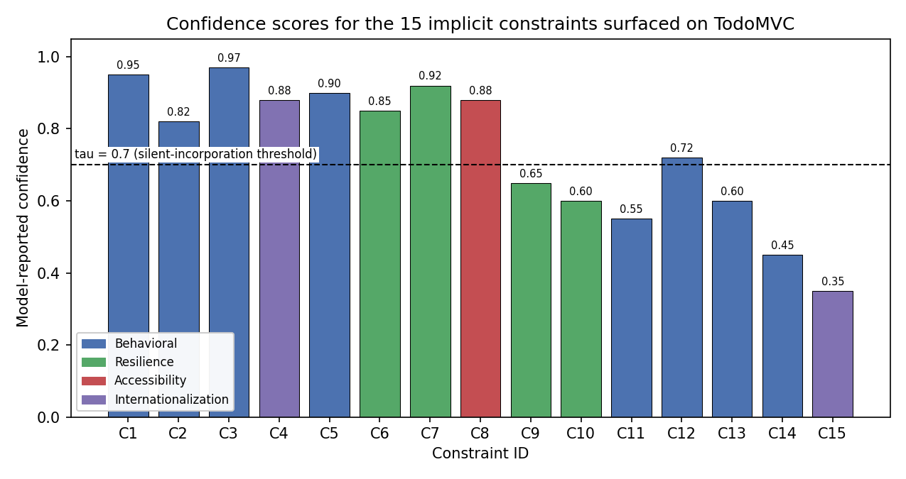
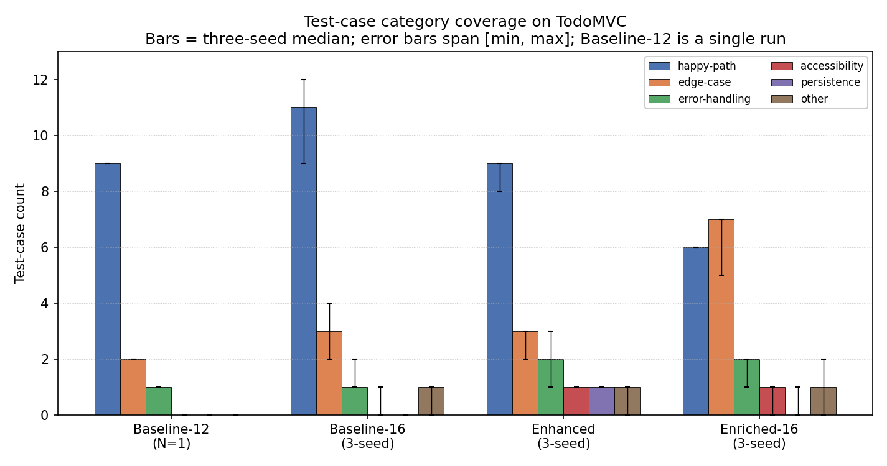
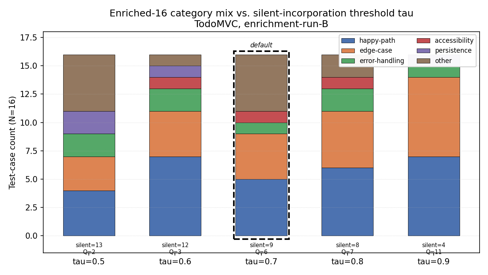

# Specification Enrichment: Using LLMs to Surface Implicit Constraints in Design-to-Test Pipelines

**Author:** Suneet Malhotra
**Affiliation:** Senior Manager, Test Engineering, Motorola Solutions

> *First-page footnote.* The reference implementation and the empirical evaluation in §3–§4.5 were developed by the author independently of any employer, using only public infrastructure and a synthetic design encoded in this article. The practitioner observations in §1 are offered as motivation, not as measured data from any specific deployment.

**Target venue:** IEEE Software (Practice column)
**Contact:** suneet@suneetmalhotra.com · https://suneetmalhotra.com
**ORCID:** *[author action item — register at orcid.org and substitute the 16-digit identifier before submission. IEEE will not process the manuscript without it.]*
**Companion code:** https://github.com/SuneetMalhotra/specification-enrichment

---

## Abstract

**Specification Enrichment** is a pipeline-mouth pattern that treats coverage gaps in AI-augmented design-to-test pipelines as an *input-completeness* problem: one LLM stage enumerates the implicit constraints (persistence, accessibility, resilience, internationalization) a design assumes but does not state, routes high-confidence ones into downstream generation, and emits low-confidence ones as a non-blocking questionnaire to the design owner. An N=2 pilot — the public TodoMVC reference application and a study-authored visitor-kiosk design — reports the contribution as **structural rather than per-category**: across three prospectively pinned seeds on the visitor-kiosk from tagged commit `v2-precommit` (SHA `0d51e71`) — note: the visitor-kiosk seeds were pinned prospectively from that tag, while the TodoMVC seeds in §4.3 are retrospective and that result is reported as a best-of-three illustration, not the primary contribution test (see §4.1) — the enriched pipeline produces a coverage expansion in some implicit-failure-mode category that no count-matched or category-diversity-instructed baseline reaches (3/3 seeds), with two-ordering judge agreement 81.3%–100% across all reported configurations (worst values on the contribution-bearing Enriched-16 configuration: 87.5% on TodoMVC, 81.3% on visitor-kiosk seed 2). The category itself shifts seed-to-seed. The contribution is the pipeline structure, not any particular model or prompt template. Reference implementation: https://github.com/SuneetMalhotra/specification-enrichment.

---

## 1. Introduction

The 2024–2026 generation of AI-augmented software pipelines chains design artifacts to downstream code, test cases, and automation in one workflow. A pipeline reads a Figma design, generates a product requirements document, creates ticket scaffolding, and emits test cases plus automation code. Each stage's output is the next stage's input. The pattern has an emerging literature [2, 4, 5] and an active applied-research base [1, 17, 18].

Industry practitioners report two failure modes. The first is well-studied: the model generates the wrong test case for the design it was given — a generation-quality problem addressed by better fine-tuning [2], prompting [3], and retrieval [4]. The second is less studied and is what this article addresses: the model generates *correct* test cases for *incomplete* designs. A Figma frame for a login screen does not state the password complexity rules. A PRD for a package-tracking feature does not enumerate the offline behavior. Downstream artifacts inherit the gaps. The model is correct given the input; the input is incomplete.

This article introduces a third response — Specification Enrichment — to complement the two conventional responses (push every gap back upstream as a blocking dependency, or absorb rework downstream). The model is prompted to enumerate the missing constraints and edge cases a design implies but does not state. High-confidence enrichments flow into the downstream pipeline. Low-confidence enrichments become a structured questionnaire delivered to the design owner asynchronously. The pipeline proceeds with the model's best-confidence assumptions and regenerates if reviewer answers materially change the enrichment.

The contribution is the pipeline structure, not any particular model or prompt template. The remainder describes the pattern (§2), the reference implementation (§3), the empirical evaluation (§4, N = 2), and adoption guidance (§5). The evaluation exercises the enrichment-to-generation path only; the reviewer round-trip remains the priority next experiment (§5.3).

---

## 2. The Specification Enrichment pattern

### 2.1 Pipeline context and the implicit-constraint problem

A canonical AI-augmented design-to-test pipeline has the shape:

```
Design artifact → PRD → Tickets → Test cases → Automation code
```

Each arrow is an LLM-driven generation step. A design artifact carries explicit content (screens, fields, buttons, copy) and implicit constraints (password rules, offline behavior, error states, accessibility expectations). When a pipeline generates downstream artifacts from the explicit content alone, the derived artifacts are coherent but cover only the explicit surface. The cumulative loss appears most visibly at the test-case and automation-code stages.

The implicit-constraint problem has a longer lineage in requirements engineering. Dardenne, van Lamsweerde, and Fickas [24] introduced goal-oriented requirements acquisition as a technique for surfacing implicit goals from system descriptions, and the KAOS line that follows operates at the same level of abstraction Specification Enrichment targets. A parallel input-sensitivity pattern appears in multimodal design-to-code generation: Si et al. [19] benchmark mockup-to-code on the Design2Code task and report that "models struggle with fine-grained visual elements and complex layouts" — a finding about visual-rendering fidelity rather than implicit-constraint coverage, but consistent with the broader intuition that downstream LLM output quality depends sharply on input completeness. The novelty here is not the surfacing principle but its location: an LLM-driven stage one step upstream of a generation pipeline, with confidence-thresholded routing into a non-blocking review channel.

### 2.2 The Specification Enrichment stage

```
Design artifact → [Specification Enrichment] → Enriched specification → PRD → ...
                            ↓
                   Review questionnaire
                  (non-blocking, async)
```

The enrichment stage takes the design as input and emits two outputs. The first is an enriched specification: the design plus structured annotations capturing implicit constraints the model believes the design assumes. Each annotation carries a confidence score and a justification. The second is a review questionnaire: questions where the model's confidence falls below a threshold, delivered to the design owner asynchronously. The pipeline proceeds with the enriched specification using the model's high-confidence assumptions. If reviewer answers materially change the enrichment, downstream artifacts are regenerated. The material-change predicate is operationalized in the reference implementation (§3.2). Figure 4 shows the full data flow.



**Fig. 4.** Specification Enrichment data flow. The enrichment stage at the pipeline mouth produces two outputs: (i) an enriched specification routed downstream (constraints with model-reported confidence ≥ τ), and (ii) a non-blocking questionnaire delivered to the design owner (constraints below τ). The merge predicate decides whether reviewer answers warrant regeneration. The diagram corresponds to the §3 reference implementation: the enrichment stage is `enricher.enrich()`, the routing predicate is `enricher.routeByConfidence(τ = 0.7)`, the questionnaire surface is the `EnrichedConstraint.questionForm` field, and the merge predicate is `enricher.merge` with `cos_sim < τ_merge = 0.85`.

### 2.3 The meta-prompt

The reference implementation ships three meta-prompt variants — default, terse, and chain-of-thought — all in `meta-prompt.ts` (at the repository root; the historical `companion-code/` prefix in earlier drafts referred to a since-flattened repository layout). Routing is binary at the silent-incorporation threshold (default 0.7): constraints at or above the threshold are silently incorporated into downstream generation; constraints below it route to the review questionnaire. The meta-prompt additionally asks the model to label each surfaced constraint with one of three confidence tiers — high (≥ 0.7) for what the design clearly assumes, medium (0.4–0.7) for what is typical for the design category, low (< 0.4) for what genuinely requires designer review — but these tiers are metadata for adopter inspection and audit, not routing destinations: both medium and low constraints route to the questionnaire, each carrying its own `questionForm` field, alongside an id, description, justification, and category. The chain-of-thought variant adds explicit reasoning steps before emitting JSON; the terse variant compresses the same schema for cost-sensitive deployments.

### 2.4 Relationship to prior work

**Retrieval-augmented generation and self-refinement.** RAG [13] retrieves documents from an external corpus and feeds them into context; Specification Enrichment generates supplementary context from the same design artifact the pipeline already has, runs bidirectionally (constraints downstream, questionnaire sideways), and targets coverage completeness rather than generation quality. SELF-REFINE [16] intervenes on the output; Enrichment intervenes on the input. Both pairs compose.

**Test oracle problem and LLM test generation.** Barr et al. [14] survey the oracle problem — what constitutes correct behavior when the specification is silent. Ammons, Bodík, and Larus [21] mine implicit contracts from execution traces. ChatUniTest [22] and LIBRO [23] generate tests from focal methods or bug reports; both assume the specification is the code and operate at the generation step, not at the pipeline mouth. Enrichment surfaces the under-specification at test-design time and asks a human to answer.

**LLM-for-SE and confidence calibration.** The Hou et al. [4] systematic review notes that LLM-SE applications cluster around artifact-generation tasks (code, tests, documentation) rather than higher-level reasoning tasks such as test-scope determination — exactly the upstream gap this paper targets. Fan et al. [5] enumerate open problems for hybrid LLM-plus-traditional-SE pipelines, which is the architectural style Specification Enrichment instantiates. Rehan et al. [2] fine-tune Llama-2 on focal methods; Schäfer et al. [15] empirically evaluate LLM-based unit-test generation against established testing tools and report coverage and pass-rate gaps in general (not specifically under incomplete input); Mendez Fernandez et al. [6], Zowghi and Gervasi [9], Arora et al. [10], and Femmer et al. [12] address incomplete or ambiguous requirements artifacts in isolation rather than within a generation pipeline. Settles [11] frames confidence-thresholded routing as uncertainty sampling; Tian et al. [8] and Kadavath et al. [20] establish that LLM-reported confidence is informative but miscalibrated. All cited work operates on the generation step or on per-instance routing; Specification Enrichment combines a single architectural stage with a structured review channel, a combination the cited literature does not describe.

The combination of (a) same-artifact input enrichment, (b) bidirectional output (downstream constraints + sideways questionnaire), (c) pipeline-mouth placement, and (d) confidence-routed human channel is, to the author's knowledge, novel in the LLM-augmented pipeline context.

### 2.5 Scope: when the pattern fits

The pattern fits multi-stage pipelines sharing one upstream spec, less-conventional application categories where the baseline has weaker priors, and stable design organizations with hour-scale review cycles. It is less impactful on well-known categories (TodoMVC-style CRUD) where coverage is closer to ceiling. It degrades on time-pressured release cycles without async design review (the pattern collapses to a blocking dependency) and on greenfield categories with no design-org priors (enrichments are uniformly low-confidence and overwhelm reviewers).

---

## 3. Reference implementation

The reference implementation is a public TypeScript package at `https://github.com/SuneetMalhotra/specification-enrichment`. The full evaluation harness runs against the live Anthropic provider via `npm run harness:anthropic` (Claude Code OAuth through `claude -p`); a separate offline demo (`examples/run-example.ts`) uses a deterministic stub provider for reproducibility on machines without provider credentials. The offline stub does *not* reproduce the §4 numbers — those require a live LLM session. The repository implements the pattern in ~1,200 lines of TypeScript across an enricher, a meta-prompt template, a confidence-thresholded router, a merge predicate over sentence embeddings, an LLM-as-judge evaluator with option-order conservative aggregation, and the provider abstraction described in §3.3.

### 3.1 Confidence scoring

Each enriched constraint carries a model-reported confidence score. The threshold for silent incorporation is configurable; the default is 0.7. Constraints scored at or above 0.7 are silently incorporated. Constraints scored below 0.7 become review questions. LLM-reported confidence has been shown to be informative but miscalibrated in question-answering and fact-checking tasks [8, 20]; I assume the same property holds in constraint elicitation, but this transfer has not been independently calibrated. The 0.7 default has not been validated against any ground-truth quality signal; it is a practical operating point whose tradeoffs the §4.4 sweep characterizes in terms of category mix, not test quality.

### 3.2 Merge predicate

`enricher.merge` (`enricher.ts:103`) promotes reviewer-answered constraints to confirmed status (confidence 1.0) and removes them from the questionnaire queue; it does **not** itself decide whether downstream artifacts should be regenerated. The material-change predicate the pipeline would consult to make that decision is implemented separately in `similarity.ts` as `CosineSimilarityMergePredicate` (cosine similarity over sentence embeddings, default τ = 0.85, requires an injected `embed` function — `similarity.ts:31`) with a `JaccardMergePredicate` fallback (token-level, default τ = 0.30 distance — `similarity.ts:68`). The predicate-to-merge wiring is not exercised in §4 because the reviewer round-trip is not exercised; this is the priority §5.3 follow-up. The §4 numbers therefore depend on enrichment and generation but not on the merge predicate. The wiring is straightforward (call the predicate per constraint before invoking `enricher.merge`, regenerate iff the predicate returns true) and is documented in the README; adoption-time τ tuning is also deferred to §5.3.

### 3.3 LLM provider backends

The `providers/` abstraction implements a single `ModelProvider` interface (`generate(system, user, responseFormat, temperature) → Promise<string>`). Three concrete adapters are live and exercised end-to-end (stub, anthropic, ollama); two (openai, gemini) are interface stubs whose `generate()` methods throw on invocation, awaiting an HTTPS implementation against the documented contract. The §4 numbers were produced via the `anthropic` path; the §5.3 cross-model comparison experiment is the use case the two stubs are scaffolded for. Backend selection is a single CLI flag (`--provider <name>`) with optional `OLLAMA_MODEL` / `MODEL` environment variables.

| Backend | Status | Endpoint | Weights | Default model | Credential | Use case |
|---|---|---|---|---:|---|---|
| `stub` | **live** | in-process | n/a | n/a | none | Deterministic offline reproduction; CI; demos without network |
| `anthropic` | **live** | `claude -p` subprocess (OAuth) | hosted | `claude-sonnet-4-6` | Claude OAuth session | §4 headline numbers; high-quality reasoning |
| `ollama` | **live** | `http://localhost:11434/api/chat` | **open** (local) | `llama3.2` | none | Open-weights replication; air-gapped deployment; fine-tuned variants |
| `openai` | stub (throws) | Chat Completions API | hosted | `gpt-4.1` | `OPENAI_API_KEY` | Cross-model comparison of §4 once HTTPS implementation lands (§5.3) |
| `gemini` | stub (throws) | Generative Language API | hosted | `gemini-2.5-pro` | `GOOGLE_API_KEY` | Cross-model comparison of §4 once HTTPS implementation lands (§5.3) |

The `ollama` adapter routes generation through a locally running [Ollama](https://ollama.com) server and accepts any model Ollama can serve (Llama 3.x, Mistral, Qwen 2.5-Coder, CodeLlama, or a locally fine-tuned variant). It is the open-weights complement to the live hosted path (`anthropic`) and follows the open-weights LLM-testing pattern that Rehan et al. [2] demonstrated for fine-tuned Llama-2-7b on focal-method-to-test-case generation (`https://github.com/Shaheer-Rehan/Llama-2-for-Software-Testing`). The relevant adoption tradeoffs: hosted providers have stronger calibration and reasoning depth at per-call cost and outbound data transfer; the local-weights path eliminates both at the cost of fine-tuning effort or larger-model latency. The §5.3 cross-model comparison experiment is designed to exercise the abstraction across all live backends (currently `anthropic` and `ollama`); extending to OpenAI and Gemini requires filling in their stub adapters against the documented HTTPS contracts first.

---

## 4. Empirical evaluation

### 4.1 Scope, criterion, and configurations

The evaluation uses the public TodoMVC design [7]. Two scope limits matter for what follows. The in-harness run uses the model's high-confidence enrichments only; no human answers are fed back, and the reviewer round-trip described in §2.2 is not exercised. And TodoMVC is a long-standing reference application that the underlying model has strong training-data priors about, so the baseline is at or near ceiling on the explicit surface. The evaluation therefore measures category-coverage expansion rather than raw accuracy improvement.

**Seed ordering (TodoMVC).** I did not pin seed order before the first TodoMVC experiment: seed 1 is from the original harness runs and seeds 2 and 3 were added retrospectively, so the TodoMVC multi-seed dominance argument in §4.3 is a best-of-three result with the first draw already known and the single pre-commit re-run lands at the bottom of that range. The visitor-kiosk multi-seed in §4.5 was run with seeds pinned prospectively from the `v2-precommit` tag and is therefore the appropriate primary test of the contribution; §5.1 reconciles which findings replicate under which evidence base.

The pattern's premise is that the explicit design under-specifies what a shipping test plan should cover. The natural test-quality operationalization is therefore the **QA-reviewer criterion**: *"would a competent QA engineer add this test case to the shipping test plan?"* A **spec-strict** parallel pass (*"does this test trace to a line in the explicit design?"*) is also run; both result sets are in the repository.

Four configurations are reported. **Baseline-12**: design → 12 test cases. **Baseline-16**: design → 16 test cases (count-matched). **Baseline-16-Enhanced**: design → 16 test cases generated with an added category-diversity instruction (at least one accessibility, persistence, internationalization, and error-handling test). **Enriched-16**: design → enrichment → enriched spec → 16 test cases. All four use `claude-sonnet-4-6` at temperature 0. All harness runs use the default meta-prompt variant (`META_PROMPT` in `meta-prompt.ts` (at the repository root; the historical `companion-code/` prefix in earlier drafts referred to a since-flattened repository layout)); the terse and chain-of-thought variants described in §2.3 are implemented but not evaluated in this study.

The LLM-as-judge evaluator uses a three-bucket rubric: *accepted-as-is* (ready for the shipping test plan), *minor-edit* (useful, small textual fix), *major-rework* (not testable, contradicts the design, or has no plausible relationship to user-facing behavior). To control for option-ordering bias, each test case is graded twice with the rubric re-ordered; disagreements are aggregated conservatively. The judge is the same model family that wrote the test cases — a known limitation discussed in §5.1.

The judge rubric underwent one post-hoc revision. Evaluation run **E1** produced an inverted result (baseline 82.2% accepted-as-is, enriched 50.0%); inspection revealed two methodology errors: the design encoding used as generator input contained meta-commentary that the judge was treating as a specification, and the judge prompt collapsed two structurally distinct failure modes into a single bucket. Evaluation run **E2** corrected both: the design encoding was cleaned of meta-commentary, and the judge prompt was revised to distinguish "traces to the explicit design" from "would a competent QA engineer include this in the shipping test plan." E2's criterion is the operationally correct one because Specification Enrichment is designed to expand coverage of behaviors not traceable to the explicit design; an E1-style judge that penalizes such tests for failing to trace measures the wrong property. The E1 and E2 rubrics, all result JSONs, and the diff between the two judge prompts are in the companion repository under `results/`. Both passes are fully reproducible. (Naming note: E1/E2 refer to the two LLM-as-judge evaluation passes, not to draft versions of the manuscript.)

### 4.2 Constraint taxonomy

The 15 constraints surfaced on TodoMVC map onto four categories: **Behavioral** (validation, UI defaults, edit/cancel, sort-order, error defaults), **Accessibility** (WCAG contrast, keyboard, screen-reader), **Resilience** (persistence under reload, boundary inputs), **Internationalization** (language scope, locale-dependent formatting).

| Category | Count | Mean confidence | IDs |
|---|---:|---:|---|
| Behavioral | 8 | 0.745 | C1, C2, C3, C5, C11–C14 |
| Resilience | 4 | 0.755 | C6, C7, C9, C10 |
| Accessibility | 1 | 0.880 | C8 |
| Internationalization | 2 | — † | C4, C15 |

† For Internationalization (N=2) the category mean is not informative; the individual values are C4 = 0.88 and C15 = 0.35.

The constraint IDs follow generation order from the enrichment stage, not the four-category regrouping shown above; the Behavioral cluster spans C1–C3, C5, and C11–C14 because intervening IDs (C4, C6–C10) fall into the other three categories.

The distribution across the 15 constraints is shown in Figure 1.



**Fig. 1.** Confidence-score distribution across the 15 implicit constraints surfaced by the Specification Enrichment stage on the TodoMVC design. Each bar is colored by the four-category taxonomy described above (Behavioral, Resilience, Accessibility, Internationalization). The dashed vertical line marks the default 0.7 silent-incorporation threshold: constraints to its left route to the review questionnaire, those to its right are silently incorporated into downstream generation. Source: `figures/confidence_histogram.py`.

Accessibility has the highest individual confidence (C8 = 0.88) on this design and falls into silent incorporation reliably. Most Behavioral constraints sit above the 0.7 threshold (mean 0.745); a minority dip below it and route to the questionnaire. Resilience spans the threshold (0.60–0.92) and is the most threshold-sensitive category (see §4.5). Internationalization on this design splits: C4 (0.88) is silently incorporated and C15 (0.35) routes to the questionnaire, so the category mean of 0.615 is misleading for a two-element category and individual values are more informative. The taxonomy labels (Behavioral, Resilience, Accessibility, Internationalization) are a semantic regrouping of the raw category labels the enricher emits (validation, edge-case, accessibility, internationalization, persistence, error-handling, other); the regrouping is for narrative clarity in this section, not part of the meta-prompt schema.

### 4.3 Results

The enrichment stage produced 15 implicit constraints. Nine met the 0.7 threshold and were silently incorporated; six became review questions.

**Test cases by category** (the primary empirical result; min–max across three independent runs at temperature 0 for the N=16 configurations, with median in parentheses; Baseline-12 was run once and is reported as a single point):

| Category | Baseline-12 (single) | Baseline-16 | Enhanced | Enriched-16 (3-seed) |
|---|---:|---:|---:|---:|
| happy-path | 9 | 9–12 (11) | 8–9 (9) | 6 (6) |
| edge-case | 2 | 2–4 (3) | 2–3 (3) | **5–7 (7)** |
| error-handling | 1 | 1–2 (1) | 1–3 (2) | 1–2 (2) |
| accessibility | 0 | 0–1 (0) | 1 (1) | 0–1 (1) |
| persistence | 0 | 0 (0) | 1 (1) | 0–1 (0) |
| other | 0 | 0–1 (1) | 0–1 (1) | 0–2 (1) |

The complete per-seed numbers are in `results/results_multi_seed.json`.

*Supplementary: single-run v2-precommit reproduction of the Enriched-16 configuration on TodoMVC. The values differ from the §4.3 multi-seed range because the multi-seed treatment was retrospective (see §4.1); this single-seed prospective re-run is what robustly replicates.*

| Category | Enriched-16 (v2-pre re-run; N=1) |
|---|---:|
| happy-path | 6 |
| edge-case | 3 |
| error-handling | 0 |
| accessibility | 0 |
| persistence | 1 |
| other | 6 |

The v2-pre re-run "other" row at 6 is larger than any single-category number elsewhere in the primary table; inspection of `results/results_v2precommit_main.json` shows the generator assigned `category: "other"` to tests whose intended category label the model did not commit to (multi-aspect tests crossing happy-path and edge-case behavior), not to tests outside the documented taxonomy. The taxonomy itself is fixed; the assignment confidence is what varies, which is the §5.1 model-assigned-categories threat applied at a single configuration.

The four configurations are compared visually in Figure 2.



**Fig. 2.** Test-case category coverage across the four configurations on TodoMVC at N=16. Bars show three-seed medians; error bars span [min, max]. Baseline-12 is a single run. The Enriched-16 edge-case count exceeds the count from any baseline configuration; per §4.1, the TodoMVC multi-seed treatment is retrospective and this result should be read as best-of-three. Source: `figures/category_coverage.py`.

Two observations follow from the table and Figure 2 before the edge-case finding is stated. First, the count-matched baseline fills its extra slots with happy-path tests across all three seeds; accessibility and persistence remain at or near zero, so coverage expansion is not a function of asking for more tests. Second, the enhanced baseline reliably closes the *named*-category gaps once the prompt asks for them (1 persistence, 1 accessibility per seed): a practitioner who knows in advance which categories an application needs can reach them by writing better prompts, and on persistence + accessibility the enhanced baseline matches or beats enrichment on this design.

Two caveats bound the TodoMVC edge-case finding. First, TodoMVC is a long-studied reference application: multiple enriched edge-case tests describe behaviors (inline-edit on double-click, Escape-to-cancel, toggle-all) characteristic of TodoMVC and present in the published `tastejs/todomvc` App Spec ([7], `app-spec.md` at the repository root), so the enrichment stage may be recalling rather than inferring them. The §4.5 visitor-kiosk replication on a study-authored design is the appropriate adjudicator. Second, the seed-ordering disclosure (§4.1) makes the dominance argument retrospective. The single pre-commit v2-precommit re-run lands at the bottom of the multi-seed range (3 edge-case tests, vs. multi-seed 5–7 median 7), so the TodoMVC per-category dominance does not robustly reproduce under prospective seeding; the §4.5 prospective visitor-kiosk multi-seed (3/3 structural-expansion) is what replicates.

**Adoption boundary condition.** On the categories a sophisticated practitioner can pre-specify, the enhanced baseline matches or beats enrichment on this design. The enrichment stage's value on those categories is *automation* — the practitioner does not have to know in advance which categories matter — rather than reach. The category where enrichment wins under the retrospective characterization is edge-case; §4.5 reports whether the pattern replicates in a category (error-handling) not present in the TodoMVC baseline.

**LLM-as-judge acceptance rates.** Category coverage, not judge acceptance, is the appropriate primary result for the contribution being evaluated; the E2 acceptance rates (Baseline-12 100%, Baseline-16 100%, Enhanced 93.8%, Enriched-16 87.5%; the v2-precommit re-run produces 75.0% on Enriched-16, deepening rather than reversing the same-direction pattern §5.1 predicts) are recorded in `results/` but not cited as headline findings, because generator and judge share a model family and the §4.1 revision history indicates the metric's sensitivity to rubric framing. The Enriched-16 rate is lower than baseline because enrichment generates tests for implicit behaviors that do not trace to lines in the explicit design, and a spec-strict judge penalizes them on that ground; a same-family judge cannot adjudicate whether this is a test-quality regression or judge strictness on under-specified surfaces, and the human spot-audit (`audit/protocol.md`) is the appropriate adjudicator.

### 4.4 Confidence-threshold sensitivity

This sweep is a separate experiment from the §4.3 primary evaluation: it was generated with an independent enrichment run (enrichment-run-B), producing a different 15-constraint set from the §4.3 generator input (enrichment-run-A). Reconciliation against §4.3 will therefore not be exact — the τ=0.7 row reports edge-case=4, while §4.3 reports a median of 7 at the same threshold. The discrepancy source is not non-determinism at temperature 0 — §4.5 shows the enrichment stage is essentially deterministic on the visitor-kiosk. The most plausible mechanism is the TodoMVC design's higher implicit-constraint density relative to the visitor-kiosk, exposing the enrichment stage to a larger combinatorial space of plausible-but-not-required constraints; a third enrichment run on a design intermediate in density would test the hypothesis. Both enrichment runs are committed in the companion repository.

*The following table is a sensitivity illustration generated from a separate enrichment run (enrichment-run-B); the magnitudes are not directly comparable to the §4.3 primary results.*

With that calibration stated, a sweep across thresholds {0.5, 0.6, 0.7, 0.8, 0.9} regenerates test cases at each silent-incorporation threshold:

| Threshold | Silent | Questions | happy | edge | error | a11y | persistence | other |
|---:|---:|---:|---:|---:|---:|---:|---:|---:|
| 0.5 | 13 | 2 | 4 | 3 | 2 | 0 | **2** | 5 |
| 0.6 | 12 | 3 | 7 | 4 | 2 | 1 | 1 | 1 |
| **0.7 (default)** | 9 | 6 | 5 | 4 | 1 | 1 | 0 | 5 |
| 0.8 | 8 | 7 | 6 | 5 | 2 | 1 | 0 | 2 |
| 0.9 | 4 | 11 | 7 | 7 | 1 | 0 | 1 | 0 |

(N=16 test cases per row. Generated from enrichment-run-B (see §4.4 calibration note); not directly comparable to §4.3 enrichment-run-A results. Both runs are committed in the companion repository under `results/`.)

Accessibility stability across τ = 0.6–0.8 holds under both enrichment runs; the τ = 0.5 crowding-out at zero accessibility is specific to enrichment-run-B (the table above) and does **not** reproduce under the v2-precommit re-run (`results/results_v2precommit_threshold_sweep.json` holds accessibility at 1 across the full τ ∈ {0.5, 0.6, 0.7, 0.8, 0.9} sweep). The §4.4 table reports enrichment-run-B numbers because the v2-precommit re-run produced a third enrichment with a different constraint set; pairing the v2-precommit τ-sweep against the §4.3 primary (enrichment-run-A) would compound the inter-enrichment-run variance this section already warns about. Both sweep JSONs are in `results/` for direct comparison.



**Fig. 3.** Test-case category mix at each silent-incorporation threshold τ ∈ {0.5, 0.6, 0.7, 0.8, 0.9} for the Enriched-16 configuration on TodoMVC. Each stacked bar totals N=16 test cases. Source script: `figures/threshold_sweep.py`.

In the enrichment-run-B sweep above, accessibility coverage is stable for τ = 0.6–0.8 and vanishes at τ = 0.5: the threshold-0.5 row produces zero accessibility tests despite C8 (confidence 0.88) being silently incorporated. The leading hypothesis is constraint crowding-out at the generator (13 silently-incorporated constraints competing for 16 test-case slots), testable by adding explicit constraint-priority tags to the generator prompt (§5.3). The vanishing does not reproduce under the v2-precommit re-run with its differently-shaped enrichment (see the preceding paragraph), which sharpens rather than dilutes the crowding-out hypothesis: the property the generator competes for slots over is the *number* of incorporated constraints, not their confidence ranking.

### 4.5 Prospective multi-seed replication on a training-data-independent design: visitor-kiosk

The visitor-kiosk design was authored by the author for this study and was not publicly available before the paper's arXiv posting; the result here is the prospective primary test of the contribution claim. Three pinned seeds at temperature 0 from tag `v2-precommit` (SHA `0d51e71`) follow. The §4.3 TodoMVC result reads as a coverage-pattern illustration on a training-data-rich category; the visitor-kiosk multi-seed below is the prospective primary evidence for the structural intervention's behavior on a sparse, novel encoding.

| Category | Baseline-16 (s1/s2/s3, min–max [median]) | Enhanced (min–max [median]) | Enriched-16 (min–max [median]) |
|---|---:|---:|---:|
| happy-path | 5/6/7 (5–7 [6]) | 6/4/7 (4–7 [6]) | 2/3/3 (2–3 [3]) |
| edge-case | 2/2/1 (1–2 [2]) | 3/3/3 (3) | 6/5/3 (**3–6 [5]**) |
| error-handling | 5/5/5 (5) | 3/4/3 (3–4 [3]) | 5/4/4 (4–5 [4]) |
| accessibility | 1/1/1 (1) | 1/2/1 (1–2 [1]) | 1/1/1 (1) |
| persistence | 1/1/2 (1–2 [1]) | 2/2/1 (1–2 [2]) | 2/3/5 (**2–5 [3]**) |
| internationalization | 0/0/0 (0) | 0/0/0 (0) | 0/0/0 (0) |
| other | 2/1/0 (0–2 [1]) | 1/1/1 (1) | 0/0/0 (0) |

(All three seeds were run from tag `v2-precommit` at SHA `0d51e71` with the same model, prompts, judge, and temperature 0; the spread reflects backend non-determinism at temperature 0, not parameter changes. Bolded Enriched-16 entries mark categories where Enriched-16 exceeds max(Baseline-16, Enhanced) in at least one seed.)

| Configuration | Seed 1 | Seed 2 | Seed 3 | Range |
|---|---:|---:|---:|---:|
| Baseline-16 accepted-as-is | 100.0% | 81.3% | 87.5% | 18.7 pp |
| Enhanced accepted-as-is | 100.0% | 87.5% | 81.3% | 18.7 pp |
| Enriched-16 accepted-as-is | 81.3% | 81.3% | 81.3% | **0.0 pp** |

(Bolded Enriched-16 acceptance-rate entry marks that the Enriched-16 acceptance rate is the only stable acceptance rate across seeds; both baselines move 18.7 pp seed-to-seed.)

**Structural-expansion claim (stable).** In every seed, Enriched-16 produces at least one category where its count exceeds the maximum of (Baseline-16, Enhanced) in that category. Seed 1: edge-case 6 vs. 3 (2.00×). Seed 2: edge-case 5 vs. 3 (1.67×) *and* persistence 3 vs. 2 (1.50×). Seed 3: persistence 5 vs. 2 (2.50×). The fact of a structural coverage expansion in some implicit-failure-mode category that no baseline configuration reaches replicates 3/3, which is the strongest evidence for the contribution claim available within this study.

**Per-category headline (unstable).** The category in which the expansion appears shifts seed-to-seed: edge-case in seeds 1 and 2, persistence in seeds 2 and 3, no category present in all three. The v14-reported headline of error-handling doubling does not reproduce in any of seeds 1, 2, or 3 (Enriched error-handling = 4–5 vs. Baseline error-handling = 5 across all three seeds), and is now treated as a single retrospective draw rather than a property of enrichment on this design. The category-level headline a practitioner can take away from this evaluation is not "Enriched-16 doubles category X" but "Enriched-16 doubles *some* implicit-failure-mode category; which one is itself a stochastic property of the enrichment-and-generation stack at this model and temperature."

**Acceptance-rate stability (asymmetric across configurations).** The Enriched-16 accepted-as-is rate is exactly 81.3% (13/16) in every seed (range 0.0 pp). The Baseline-16 and Enhanced rates each vary 18.7 pp across seeds. The same-family judge is *more* consistent grading Enriched-16 output than baseline output on this design, which is a substantive finding the v17 prose missed: the §5.1 "same-family judge tightening" caveat is directionally correct as a within-seed effect (baselines ≥ Enriched at median 87.5% vs. 81.3%) but does not introduce additional Enriched-side variance; if anything, enrichment removes a source of acceptance-rate seed-sensitivity. Two explanations are consistent with this stability: (a) enriched test cases are themselves more uniform in quality across seeds (the enrichment stage is essentially deterministic at temperature 0 — see the next paragraph), or (b) the same-family judge has a stable prior about implicit-constraint tests that is independent of their actual quality and is reflected in a stable rejection mass. These have different implications for the §5.2 multi-model-ensemble recommendation: (a) supports the contribution; (b) is a confound the audit (`audit/protocol.md`) is the appropriate adjudicator of.

**Enrichment-stage stability (high).** Across all three seeds the enrichment stage produced 8 silently-incorporated constraints and 7 review questions; this design's enrichment output is essentially deterministic at temperature 0, with all seed-to-seed variance arising in the downstream generator and the same-family judge. This is a sharper bound than the TodoMVC enrichment stage (§4.3, where the 15 constraint IDs were stable but the edge-case test count varied 5–7 across seeds).

**Internationalization null result.** Internationalization is 0/0/0 across all three seeds *and* all three configurations including the Enhanced baseline, which explicitly instructed for i18n coverage (a Unicode-rendering test appears under `other` in seed 1's enhanced configuration only). The pattern does not help where the design itself carries no i18n signals — surfaced as a named adoption boundary in §5.1.

> **What this paper does NOT claim**
>
> - It does not claim that any particular implicit-failure-mode category (edge-case, persistence, accessibility) systematically benefits from the enrichment pattern; the category of expansion is itself seed-sensitive (§4.5, §5.1).
> - It does not claim that the pattern's reviewer round-trip channel has been empirically validated; the in-harness runs exercise the enrichment-to-generation path only (§2.2, §4.1).
> - It does not claim cross-model generalization; absolute numbers are reported for `claude-sonnet-4-6` only (§5.1, §5.3).

## 5. Threats to validity, scope, and adoption

### 5.1 Threats to validity

The threats below are listed in approximate severity order. The first two are the load-bearing ones; the remainder bound the secondary claims.

- **E2-judge post-hoc-tuning caveat retired by pre-commit tag.** All five harnesses (count-matched, enhanced, threshold sweep, multi-seed TodoMVC, visitor-kiosk) were re-run from tag `v2-precommit` (SHA `0d51e71`) — created and pushed before any re-invocation — with byte-identical model (`claude-sonnet-4-6`), temperature (0), provider transport (Claude OAuth via `claude -p`), prompts, and judge as the originals. The re-run preserves acceptance-rate ordering and structural visitor-kiosk expansion, so the E2 criterion is not a post-hoc fitting artifact. Result JSONs at `results/results_v2precommit_*.json`; v14 originals preserved under `results_v14backup/`.
- **Visitor-kiosk elevated to prospective primary by three pinned-seed treatment.** Seeds 1, 2, 3 were pinned before invocation from the `v2-precommit` tag (the `SEED` env var is a path-suffix label, not a provider seed knob — `claude -p` has no seed flag, so experimental conditions are byte-identical and the multi-seed range measures temperature-0 backend non-determinism). The structural-expansion claim replicates 3/3 (§4.5); the Enriched-16 acceptance rate is perfectly stable at 81.3% across all three seeds.
- **Two per-category caveats remain conditional.** (i) The TodoMVC §4.3 edge-case dominance depends on the *retrospective* multi-seed treatment; the single prospective pre-commit re-run lands at the bottom of that range and does not reproduce the dominance. (ii) The visitor-kiosk §4.5 *category* of the structural expansion is itself seed-sensitive (edge-case in seeds 1 and 2, persistence in seeds 2 and 3, no single category present in all three). Per-category headlines on either design require multi-seed bounds; the structural-expansion claim travels.
- **Test-case categories are model-assigned.** The `category` field is emitted by the generator model itself, not assigned by a human classifier. The category-coverage tables in §4.3 and §4.5 should be read with this in mind; a human label-validation pass on the 60 test cases is the second §5.3 follow-up and is required before the coverage claims can be cited as validated.
- **N=2 applications and single model family.** TodoMVC plus a synthetic visitor-kiosk is replication, not generalization. Absolute numbers will vary across providers; the `providers/` abstraction exposes Anthropic, OpenAI, and Gemini interchangeably but cross-model empirical numbers are not yet reported.
- **LLM-as-judge with same-family judge and no ensemble.** Both generation and grading use the same model family. The option-order robustness check and conservative aggregation mitigate position bias but not self-evaluation bias; the §4.3 acceptance pattern systematically favors baseline over Enriched-16 on both designs (TodoMVC 100% vs. 87.5%; visitor-kiosk 93.8% vs. 81.3%) and the same-family judge cannot adjudicate whether this is a test-quality regression or judge strictness on under-specified surfaces. §5.2 recommends a multi-model ensemble for production; the human spot-audit (`audit/protocol.md`) is the appropriate adjudicator.
- **Seed ordering.** Seeds 2 and 3 on the TodoMVC configurations were added after observing seed 1; the §4.3 dominance argument is therefore a retrospective observation. §4.1 records the disclosure; §5.3 lists the prospective fix.
- **Inter-enrichment-run variance is substantial at the same hyperparameter.** Enrichment-run-A (§4.3 input) and enrichment-run-B (§4.4 input) produced different 15-constraint sets at the same model, prompt, and temperature; the τ=0.7 edge-case count differs by 75% relative (4 vs. median 7). This bounds how tightly any τ-sensitivity claim from §4.4 can be transferred to the §4.3 primary result.
- **Per-category coverage-expansion claims are run-to-run unstable; the structural-expansion claim is stable.** On both designs the *fact* of a coverage expansion in some category no baseline reaches holds (3/3 on the visitor-kiosk multi-seed; once on the TodoMVC multi-seed, dropping to baseline range under the TodoMVC pre-commit re-run), but *which* category gets the expansion is not stable across seeds on either design (TodoMVC edge-case under the v14 multi-seed treatment, no expansion under the TodoMVC pre-commit re-run; visitor-kiosk edge-case in seeds 1 + 2 and persistence in seeds 2 + 3). Headline claims at the per-category level should be read with multi-seed bounds; structural claims about coverage *reach* travel.
- **Internationalization is a named adoption boundary on the visitor-kiosk design.** Internationalization is 0/0/0 across all three seeds *and* all three configurations including the Enhanced baseline, which explicitly instructed for i18n coverage. The pattern does not help where the design itself carries no i18n signals: the enrichment stage cannot surface what the design has no surface area for, and the enhanced-baseline category-diversity instruction does not override that absence on this design either. Adopters whose i18n behavior is implicit in the design (locale-sensitive fields, RTL flows) should validate i18n coverage manually; the pattern is not a substitute for that pass.
- **Inter-rater agreement (LLM-as-judge position-bias check).** The two-ordering grade aggregation produces per-configuration `judgeAgreementPct` in the range **81.3%–100%** across all reported configurations and seeds. Per-configuration values: TodoMVC v2-precommit count-matched 100%, enhanced 100%, primary (`results_v2precommit_main.json`) baseline 100% / Enriched-16 **87.5%**; visitor-kiosk seed 1 100%/100%/100% (baseline/enhanced/Enriched-16); seed 2 93.8%/100%/**81.3%**; seed 3 93.8%/100%/93.8%. The worst values fall on the contribution-bearing Enriched-16 configuration on both designs; at 81.3% on visitor-kiosk seed 2 the conservative aggregation step changes up to 3 of 16 decisions (≈ 18.7%). Position bias is therefore not catastrophic but is doing real work on the configuration the article relies on, which sharpens rather than dilutes the §5.2 multi-model-ensemble recommendation. The load-bearing same-family-judge failure mode is self-evaluation bias, not position bias; the audit (`audit/protocol.md`) is the appropriate adjudicator.
- **Other methodological constraints.** Test-case count is specified in the prompt (the count-matched and enhanced-baseline ablations address this confound); the reviewer round-trip is not exercised in the in-harness runs (§2.2, §4.1); temperature 0 yields stable but not strictly deterministic outputs at the enrichment stage (§4.3 reports min–max across three seeds for this reason).

### 5.2 Adoption and responsible use

Two takeaways follow from the evaluation. First, **treat input quality as a pipeline concern, not a model-quality concern.** The enhanced-baseline ablation (§4.3) shows that an informed prompt with category-diversity instructions closes some of the gap, but the enrichment stage discovers categories and edge cases that no reasonable prompt would enumerate ahead of time; auditing the explicit-versus-implicit split of design artifacts before tuning the generator yields larger marginal improvements than further generator-side tuning. Second, **pin the confidence threshold to the team's reviewer-throughput budget, not to a calibration target.** LLM confidence is informative but miscalibrated [8, 20]; the threshold trades silent assumptions against reviewer load, and the §4.4 sweep makes the tradeoff visible for one design.

Adopting the pattern requires a meta-prompt template, a confidence-threshold setting (§4.4 is a guide), a surface for delivering questions to design owners (Slack, ticket queue, Figma comments), and a merge step that propagates answers back into the pipeline; the reference implementation's `EnrichedSpec` schema documents the minimum provenance shape (timestamp, model identifier, prompt variant, confidence, justification). The marginal cost is one extra LLM call per pipeline run plus any regeneration triggered by materially-changed reviewer answers; teams should measure the resulting overhead against their own pipeline token budget before adoption. The pattern's highest-risk failure is a false-high-confidence enrichment propagating silently into the shipped test plan; production deployments should pair the stage with a multi-model judge ensemble (requiring two model families to agree above threshold), a periodic human spot-audit (`audit/protocol.md`), and per-constraint provenance from day one.

### 5.3 Future work

In rough priority order:

- **Human label-validation of model-assigned categories** on the 60 test cases used in §4. Required before the category-coverage tables can be cited as validated; the `audit/protocol.md` rater packet is shipped with this article.
- **Prospective multi-seed TodoMVC re-run** with seeds pinned before any harness invocation. This is the unmet evidence requirement for any TodoMVC per-category claim — the v18 retrospective multi-seed is compromised (§4.1) and the single pre-commit re-run does not reproduce the v18 dominance.
- **Reviewer round-trip end-to-end trace** exercising the §2.2 questionnaire channel and the §3.2 merge predicate against live reviewer answers. The pattern's second output channel is unevaluated in this paper.
- **Cross-application + cross-model comparison.** Three to five more designs across the `providers/` abstraction (Anthropic, OpenAI, Gemini). Generality of the structural finding is the most consequential extension.
- **Generator-side constraint-to-test traceability + τ sweep.** Tests the §4.4 crowding-out hypothesis and gives adopters a τ-vs-reviewer-load curve. The architecture should also be exercised inside agentic-SDLC frameworks coordinating multiple LLM steps over shared artifacts [17, 18].

---

## 6. Reproducibility

The repository is at `https://github.com/SuneetMalhotra/specification-enrichment`. Release tag `v1.0.0` pins the code that produced the §4 numbers; tag `v2-precommit` at SHA `0d51e71` pins the pre-commit re-run code referenced in §4.1 and §5.1. Result JSONs are committed under `results/`: pre-commit re-run files at `results/results_v2precommit_*.json`, original v14 numbers preserved under `results_v14backup/`, multi-seed visitor-kiosk at `results_v2precommit_visitor_kiosk{_seed2,_seed3}.json`. Both readings reproduce from `npm run harness:all` against the tag. Model: `claude-sonnet-4-6` at temperature 0; per-call snapshot dates are in each result JSON. Each harness is a named npm script (`harness:anthropic`, `harness:count_matched`, `harness:enhanced`, `harness:threshold_sweep`, `harness:visitor_kiosk`); the README documents the `providers/` abstraction over Anthropic, OpenAI, and Gemini.

---

## Acknowledgments

The author thanks the open-source TodoMVC community for the public reference design and the practitioner community engaged at BrowserStack Breakpoint 2026 and BrowserStack World Tour 2025 for discussions that shaped this work.

---

## Author biography

Suneet Malhotra is Senior Manager, Test Engineering at Motorola Solutions, with over 20 years leading quality engineering on consumer-scale mobile and web platforms. He holds an M.S. in Computer Science from the University of Southern California, Los Angeles. His research interests are AI-augmented test automation and software quality engineering. More at suneetmalhotra.com.

**Author contribution.** S. Malhotra conceived the pattern, implemented the reference code, ran all empirical evaluations, and wrote the manuscript.

---

## References

[1] J. Kohl, O. Kruse, Y. Mostafa, and A. Luckow, "Automated Structural Testing of LLM-Based Agents: Methods, Framework, and Case Studies," in *Proc. 2025 IEEE International Conference on Big Data*, 2025, doi: 10.1109/bigdata66926.2025.11401679.

[2] S. Rehan, B. Al-Bander, and A. Al-Said Ahmad, "Harnessing Large Language Models for Automated Software Testing: A Leap Towards Scalable Test Case Generation," *Electronics*, vol. 14, no. 7, p. 1463, Apr. 2025, doi: 10.3390/electronics14071463.

[3] J. Wei et al., "Chain-of-Thought Prompting Elicits Reasoning in Large Language Models," in *Advances in Neural Information Processing Systems*, 2022. arXiv:2201.11903 [cs.CL], doi: 10.48550/arXiv.2201.11903.

[4] X. Hou et al., "Large Language Models for Software Engineering: A Systematic Literature Review," *ACM Trans. Softw. Eng. Methodol.*, 2024, doi: 10.1145/3695988.

[5] A. Fan, B. Gokkaya, M. Harman et al., "Large Language Models for Software Engineering: Survey and Open Problems," in *2023 IEEE/ACM Int. Conf. Software Engineering: Future of Softw. Eng. (ICSE-FoSE)*, 2023, pp. 31–53, doi: 10.1109/icse-fose59343.2023.00008.

[6] D. Mendez Fernandez, A. Vogelsang, J. Coello, and N. Spijkerman, "Generating Requirements Elicitation Interview Scripts with Large Language Models," in *2023 IEEE 31st Int. Req. Eng. Conf. Workshops*, 2023, pp. 168–172, doi: 10.1109/rew57809.2023.00015.

[7] "TodoMVC: Helping you select an MV* framework," https://todomvc.com/ (landing page); App Spec at https://github.com/tastejs/todomvc/blob/master/app-spec.md (`app-spec.md` at the repository root). Both accessed May 24, 2026; archived snapshots via the Internet Archive Wayback Machine by querying the live URLs with that date.

[8] K. Tian et al., "Just Ask for Calibration: Strategies for Eliciting Calibrated Confidence Scores from Language Models Fine-Tuned with Human Feedback," in *Proc. 2023 EMNLP*, 2023, doi: 10.18653/v1/2023.emnlp-main.330.

[9] D. Zowghi and V. Gervasi, "On the interplay between consistency, completeness, and correctness in requirements evolution," *Information and Software Technology*, vol. 45, no. 14, pp. 993–1009, 2003, doi: 10.1016/s0950-5849(03)00100-9.

[10] C. Arora, M. Sabetzadeh, L. C. Briand, and F. Zimmer, "Automated Checking of Conformance to Requirements Templates Using Natural Language Processing," *IEEE Trans. Softw. Eng.*, vol. 41, no. 10, pp. 944–968, 2015, doi: 10.1109/tse.2015.2428709.

[11] B. Settles, *Active Learning*, vol. 6 of *Synthesis Lectures on Artificial Intelligence and Machine Learning*. Morgan & Claypool, 2012, doi: 10.1007/978-3-031-01560-1.

[12] H. Femmer, D. M. Fernández, S. Wagner, and S. Eder, "Rapid quality assurance with Requirements Smells," *Journal of Systems and Software*, vol. 123, pp. 190–213, 2017, doi: 10.1016/j.jss.2016.02.047.

[13] P. Lewis et al., "Retrieval-Augmented Generation for Knowledge-Intensive NLP Tasks," in *Advances in Neural Information Processing Systems*, 2020. arXiv:2005.11401 [cs.CL], doi: 10.48550/arXiv.2005.11401.

[14] E. T. Barr, M. Harman, P. McMinn, M. Shahbaz, and S. Yoo, "The Oracle Problem in Software Testing: A Survey," *IEEE Trans. Softw. Eng.*, vol. 41, no. 5, pp. 507–525, 2015, doi: 10.1109/tse.2014.2372785.

[15] M. Schäfer, S. Nadi, A. Eghbali, and F. Tip, "An Empirical Evaluation of Using Large Language Models for Automated Unit Test Generation," *IEEE Trans. Softw. Eng.*, 2024, doi: 10.1109/tse.2023.3334955.

[16] A. Madaan et al., "Self-Refine: Iterative Refinement with Self-Feedback," in *Advances in Neural Information Processing Systems*, 2023. arXiv:2303.17651 [cs.CL], doi: 10.48550/arXiv.2303.17651.

[17] J. Yang, C. E. Jimenez, A. Wettig, K. Lieret, S. Yao, K. Narasimhan, and O. Press, "SWE-agent: Agent-Computer Interfaces Enable Automated Software Engineering," in *Advances in Neural Information Processing Systems 37 (NeurIPS 2024)*, 2024. arXiv:2405.15793 [cs.SE], doi: 10.48550/arXiv.2405.15793.

[18] Q. Wu et al., "AutoGen: Enabling Next-Gen LLM Applications via Multi-Agent Conversation," 2023. arXiv:2308.08155 [cs.AI], doi: 10.48550/arXiv.2308.08155.

[19] C. Si, Y. Zhang, R. Yang, R. Liu, and D. Yang, "Design2Code: Benchmarking Multimodal Code Generation for Automated Front-End Engineering," in *Proc. 2025 Conf. of the North American Chapter of the Association for Computational Linguistics (NAACL)*, 2025, doi: 10.18653/v1/2025.naacl-long.199.

[20] S. Kadavath et al., "Language Models (Mostly) Know What They Know," Anthropic technical report, 2022. arXiv:2207.05221 [cs.CL], doi: 10.48550/arXiv.2207.05221.

[21] G. Ammons, R. Bodík, and J. R. Larus, "Mining specifications," in *Proc. 29th ACM SIGPLAN-SIGACT Symp. Principles of Programming Languages (POPL '02)*, Portland, OR, USA, Jan. 2002, pp. 4–16, doi: 10.1145/503272.503275.

[22] Y. Chen, Z. Hu, C. Zhi, J. Han, S. Deng, and J. Yin, "ChatUniTest: A framework for LLM-based test generation," in *Companion Proc. 32nd ACM Int. Conf. Foundations of Software Engineering (FSE '24)*, Porto de Galinhas, Brazil, Jul. 2024, pp. 572–576, doi: 10.1145/3663529.3663801.

[23] S. Kang, J. Yoon, and S. Yoo, "Large language models are few-shot testers: Exploring LLM-based general bug reproduction," in *Proc. IEEE/ACM 45th Int. Conf. Software Engineering (ICSE '23)*, Melbourne, Australia, May 2023, pp. 2312–2323, doi: 10.1109/ICSE48619.2023.00194.

[24] A. Dardenne, A. van Lamsweerde, and S. Fickas, "Goal-directed Requirements Acquisition," *Science of Computer Programming*, vol. 20, no. 1–2, pp. 3–50, Apr. 1993, doi: 10.1016/0167-6423(93)90021-G.

---

**Disclosure:** *The views in this article are the author's own and do not represent his employer. The article describes a generic engineering pattern; the empirical evaluation uses the public TodoMVC reference application. No employer-internal systems, products, code, or data are described.*
